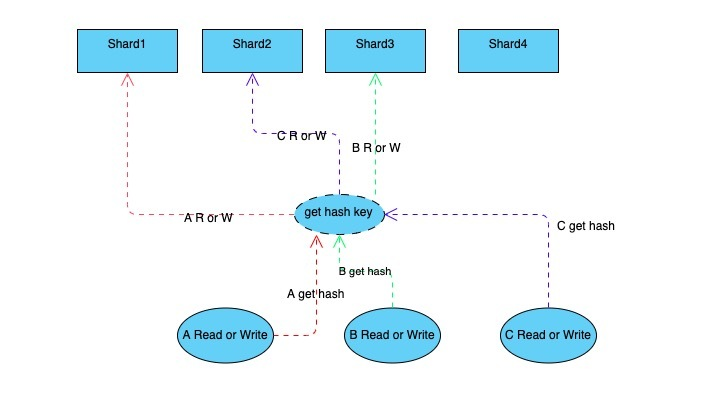

## Resp协议
RESP 定义了 5 种格式：

简单字符串（Simple String）： 服务器用来返回简单的结果，比如 "OK" 非二进制安全，且不允许换行
错误信息（Error）：服务器用来返回简单的错误信息，比如 "ERR Invalid Synatx" 非二进制安全，且不允许换行
整数（Integer）：llen、scard 等命令的返回值，64 位有符号整数
字符串（Bulk String）：二进制安全字符串，比如 get 等命令的返回值
数组（Array，又称 Multi Bulk Strings）：Bulk String 数组，客户端发送指令以及 lrange 等命令响应的格式

RESP 通过第一个字符来表示格式：

简单字符串：以"+" 开始， 如："+OK\r\n"
错误：以"-" 开始，如："-ERR Invalid Synatx\r\n"
整数：以":"开始，如：":1\r\n"
字符串：以 $ 开始
数组：以 * 开始

## 内存数据库
与单线程的 Redis 不同我们实现的 Redis（godis）是并行工作的，所以我们必须考虑各种并发安全问题。常见的并发安全哈希表设计有几种：

sync.map：
Golang 官方提供的并发哈希表，适合读多写少的场景。但是在 m.dirty 刚被提升后会将 m.read 复制到新的 m.dirty 中，在数据量较大的情况下复制操作会阻塞所有协程，存在较大的隐患。

juc.ConcurrentHashMap：
Java 的并发哈希表采用分段锁实现。在进行扩容时访问哈希表线程都将协助进行 rehash 操作，在 rehash 结束前所有的读写操作都会阻塞。因为缓存数据库中键值对数量巨大且对读写操作响应时间要求较高，使用 juc 的策略是不合适的。

memcached hashtable：
在后台线程进行 rehash 操作时，主线程会判断要访问的哈希槽是否已被 rehash 从而决定操作 old_hashtable 还是操作 new_hashtable。这种设计被称为渐进式 rehash 它的优点是 rehash 操作基本不会阻塞主线程的读写，是最理想的的方案。

但渐进式 rehash 的实现非常复杂，所以 godis 采用 Golang 社区广泛使用的分段锁策略（非上面的三种），就是将 key 分散到固定数量的 shard 中避免进行整体 rehash 操作。shard 是有锁保护的 map，当 shard 进行 rehash 时会阻塞 shard 内的读写，但不会对其他 shard 造成影响。

优化TODO
1. 优雅关闭
2. 更多的指令集

BenchMark测试记录（当前只有支持测试的命令只有3/4个）

====== PING_INLINE ======
100000 requests completed in 5.17 seconds
50 parallel clients
3 bytes payload
keep alive: 1

9.10% <= 1 milliseconds
66.49% <= 2 milliseconds
86.21% <= 3 milliseconds
95.69% <= 4 milliseconds
98.88% <= 5 milliseconds
99.63% <= 6 milliseconds
99.83% <= 7 milliseconds
99.94% <= 8 milliseconds
99.97% <= 9 milliseconds
99.97% <= 10 milliseconds
99.98% <= 18 milliseconds
99.98% <= 19 milliseconds
99.99% <= 20 milliseconds
100.00% <= 21 milliseconds
100.00% <= 21 milliseconds
19327.41 requests per second

====== PING_BULK ======
100000 requests completed in 4.63 seconds
50 parallel clients
3 bytes payload
keep alive: 1

24.18% <= 1 milliseconds
83.60% <= 2 milliseconds
94.63% <= 3 milliseconds
98.14% <= 4 milliseconds
99.21% <= 5 milliseconds
99.65% <= 6 milliseconds
99.84% <= 7 milliseconds
99.90% <= 8 milliseconds
99.92% <= 9 milliseconds
99.94% <= 10 milliseconds
99.95% <= 11 milliseconds
99.95% <= 12 milliseconds
99.96% <= 13 milliseconds
99.96% <= 14 milliseconds
99.97% <= 15 milliseconds
99.97% <= 16 milliseconds
99.97% <= 17 milliseconds
99.98% <= 18 milliseconds
99.98% <= 19 milliseconds
99.99% <= 20 milliseconds
99.99% <= 21 milliseconds
100.00% <= 22 milliseconds
100.00% <= 23 milliseconds
100.00% <= 24 milliseconds
21584.29 requests per second

====== SET ======
100000 requests completed in 3.50 seconds
50 parallel clients
3 bytes payload
keep alive: 1

56.99% <= 1 milliseconds
91.25% <= 2 milliseconds
98.15% <= 3 milliseconds
99.73% <= 4 milliseconds
99.84% <= 5 milliseconds
99.85% <= 22 milliseconds
99.86% <= 23 milliseconds
99.87% <= 24 milliseconds
99.88% <= 25 milliseconds
99.90% <= 26 milliseconds
99.90% <= 33 milliseconds
99.90% <= 34 milliseconds
99.92% <= 35 milliseconds
99.93% <= 36 milliseconds
99.95% <= 37 milliseconds
99.95% <= 110 milliseconds
99.96% <= 111 milliseconds
99.98% <= 112 milliseconds
99.98% <= 113 milliseconds
100.00% <= 114 milliseconds
100.00% <= 114 milliseconds
28538.81 requests per second

====== GET ======
100000 requests completed in 3.42 seconds
50 parallel clients
3 bytes payload
keep alive: 1

50.05% <= 1 milliseconds
86.45% <= 2 milliseconds
96.77% <= 3 milliseconds
99.32% <= 4 milliseconds
99.64% <= 5 milliseconds
99.82% <= 6 milliseconds
99.92% <= 7 milliseconds
99.95% <= 8 milliseconds
99.96% <= 9 milliseconds
99.97% <= 10 milliseconds
99.98% <= 11 milliseconds
99.98% <= 12 milliseconds
99.99% <= 13 milliseconds
100.00% <= 13 milliseconds
29205.61 requests per second

====== INCR ======
100000 requests completed in 3.23 seconds
50 parallel clients
3 bytes payload
keep alive: 1

60.60% <= 1 milliseconds
89.83% <= 2 milliseconds
98.03% <= 3 milliseconds
99.72% <= 4 milliseconds
99.95% <= 5 milliseconds
99.97% <= 7 milliseconds
99.97% <= 8 milliseconds
99.99% <= 9 milliseconds
99.99% <= 11 milliseconds
99.99% <= 12 milliseconds
100.00% <= 13 milliseconds
100.00% <= 15 milliseconds
100.00% <= 15 milliseconds
30978.94 requests per second

C:\Users\Allen>redis-benchmark -p 9012
====== PING_INLINE ======
100000 requests completed in 6.71 seconds
50 parallel clients
3 bytes payload
keep alive: 1

1.55% <= 1 milliseconds
75.59% <= 2 milliseconds
98.71% <= 3 milliseconds
99.81% <= 4 milliseconds
99.95% <= 5 milliseconds
99.99% <= 6 milliseconds
100.00% <= 7 milliseconds
14900.91 requests per second

====== PING_BULK ======
100000 requests completed in 5.08 seconds
50 parallel clients
3 bytes payload
keep alive: 1

23.68% <= 1 milliseconds
92.73% <= 2 milliseconds
99.65% <= 3 milliseconds
99.98% <= 4 milliseconds
100.00% <= 4 milliseconds
19696.67 requests per second

====== SET ======
100000 requests completed in 5.20 seconds
50 parallel clients
3 bytes payload
keep alive: 1

11.24% <= 1 milliseconds
99.43% <= 2 milliseconds
100.00% <= 3 milliseconds
100.00% <= 3 milliseconds
19241.87 requests per second

====== GET ======
100000 requests completed in 4.75 seconds
50 parallel clients
3 bytes payload
keep alive: 1

23.89% <= 1 milliseconds
99.25% <= 2 milliseconds
100.00% <= 3 milliseconds
100.00% <= 3 milliseconds
21057.06 requests per second
