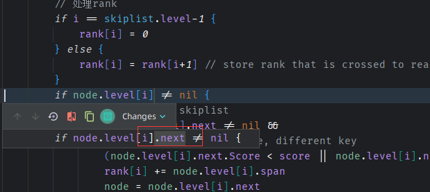
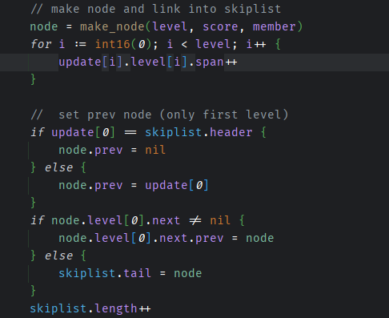
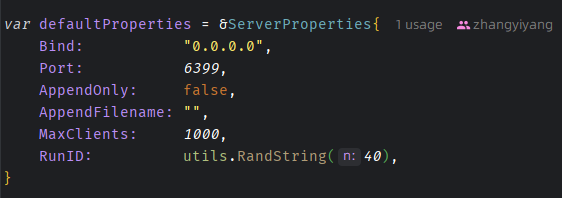
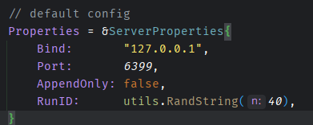
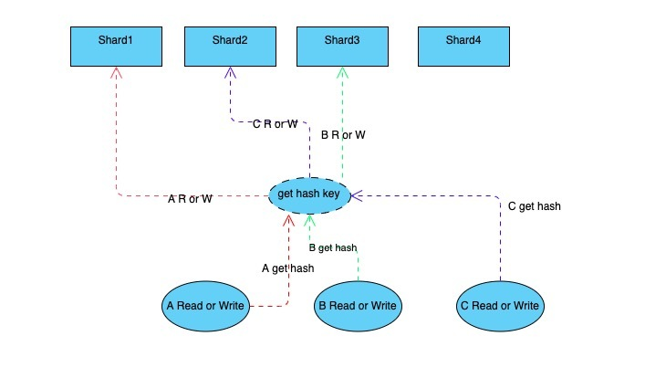

## 7/19 
实现了hash和sortedSet
但是测试still没有通过，还存在一些bug
## 7/16
实现HashMap的时候尝试重新改造和
实现k-v型存储的方式，来提升性能
使用FNW算法和使用稍微简单一点的分段锁的策略来实现

fnv32(key string) uint32函数是一个基于FNV-1a哈希算法的32位哈希函数。它接受一个字符串key作为输入，并将其转换为一个32位无符号整数（uint32）的哈希值。该函数通过不断迭代和混合素数与字符的ASCII码来计算哈希值。在哈希计算开始时，使用常量2166136261（16进制为0x811C9DC5）作为初始值。在每次迭代中，哈希值与素数（prime32）相乘，然后与当前字符的ASCII码异或。最终得到的哈希值就是所求的结果。

spread(hashCode uint32) uint32函数是一个散列函数，用于将哈希值散列到哈希表的索引范围内。该函数接受一个32位的哈希值hashCode作为输入，并返回一个在哈希表大小范围内的索引值。它通过将hashCode与哈希表大小减1（tableSize - 1）进行按位与操作来实现。这样可以确保计算出的索引值在合法的范围内，即在0到(tableSize - 1)之间。

getShard(index uint32) *shard函数是用于获取并发哈希表中特定索引位置的分片（shard）。哈希表被分成多个分片，每个分片是一个独立的哈希表，用于处理并发访问。在这个函数中，通过传入的索引值index获取相应的分片。若哈希表为空（dict为nil），则会触发panic。
## 7/13 
实现部分接口
对于zset的range 和border理解和实现

## 7/10
实现了所有的zset，增加测试代码，找到了一个插入的bug
1. BUG1:

2. BUG2: 没有连接

## 7/9 
实现了大部分的Sortedset
## 7/8
skipList的实现
## 7/7
优化增加SortedSet结构
首先写skiplist，过程中
## 7/4 优化
优化了随机数种子的失效问题,
> 由于使用了`var r = rand.New(rand.NewSource(time.Now().UnixNano()))` 所以说如果rand.NewSource 函数用于创建一个新的伪随机数生成器种子。而 rand.Seed 函数用于初始化默认的伪随机数生成器种子。在每次调用 rand.Intn 之前，如果没有调用 rand.Seed 函数设置种子，将会使用默认的种子，导致生成的随机数序列相同，导致seed一样，导致字符串是一样的，解决方法是吧局部变量编程全局变量，避免在函数调用的时候生成相同的种子，提高随机性
rand.NewSource(time.Now().UnixNano()) 移到函数外部作为全局变量，并在程序启动时使用 rand.Seed 函数设置种子。这样可以避免在每次函数调用时生成相同的种子。
优化增加了set的测试代码
## 7/2 优化
+ 优化standalone_server 执行方法 
+ 客户端conn， 优化使用sync.Pool缓冲池 
+ 增加封装aofHandler进入persistance 持久化机制 
+ 重命名和修改一些细节
+ 修改之后集群模式可能有一点问题
+ StandaloneServer实现了DBEngine不只是DB
+ 需要优化很多地方：prepare和undo模式， slave很久之后优化，conn的优化 ，database.db的优化
## 配置方式和补充
1. 如果使用的方式是Config方式：
2. 如果配置了集群方式的话IsCluster = true，就需要给出ClusterConfigPath否则error，配置方式须为Json格式
3. 如果配置了集群，会读取RaftAddr，如果没有配置RaftAddr 默认读取PeerAddrs，如果开启了集群模式，默认database都是1，集群模式暂时只支持单base
4. 相对于配置文件命令行配置优先级高
5. 默认端口是6399

> 注意配置如果没有给配置文件，默认配置是 

> 如果给了配置文件默认初始化的配置是

## tcpServer
1. TCPserver中通过一个Handler来缺点是不是启用Cluster模式
2. syscall.SIGHUP, syscall.SIGQUIT, syscall.SIGTERM, syscall.SIGINT如果接收到这些信号的话，那么服务器会优雅关闭（把相关资源回收之后再关）

6/26 优化，把原来两种一个是panic的关闭和一个信号的关闭二合一，通过channel来控制，如果信号channel接收到关闭信号，那么就会优雅关闭，否则就是err channel接收信号
## Resp协议
RESP 定义了 5 种格式：

1. 简单字符串（Simple String）： 服务器用来返回简单的结果，比如 "OK" 非二进制安全，且不允许换行
2. 错误信息（Error）：服务器用来返回简单的错误信息，比如 "ERR Invalid Synatx" 非二进制安全，且不允许换行
3. 整数（Integer）：llen、scard 等命令的返回值，64 位有符号整数
4. 字符串（Bulk String）：二进制安全字符串，比如 get 等命令的返回值
5. 数组（Array，又称 Multi Bulk Strings）：Bulk String 数组，客户端发送指令以及 lrange 等命令响应的格式

RESP 通过第一个字符来表示格式：

1. 简单字符串：以"+" 开始， 如："+OK\r\n"
2. 错误：以"-" 开始，如："-ERR Invalid Synatx\r\n"
3. 整数：以":"开始，如：":1\r\n"
4. 字符串：以 $ 开始
5. 数组：以 * 开始

## 内存数据库
与单线程的 Redis 不同我们实现的 Redis（godis）是并行工作的，所以我们必须考虑各种并发安全问题。常见的并发安全哈希表设计有几种：

sync.map：
Golang 官方提供的并发哈希表，适合读多写少的场景。但是在 m.dirty 刚被提升后会将 m.read 复制到新的 m.dirty 中，在数据量较大的情况下复制操作会阻塞所有协程，存在较大的隐患。

juc.ConcurrentHashMap：
Java 的并发哈希表采用分段锁实现。在进行扩容时访问哈希表线程都将协助进行 rehash 操作，在 rehash 结束前所有的读写操作都会阻塞。因为缓存数据库中键值对数量巨大且对读写操作响应时间要求较高，使用 juc 的策略是不合适的。

memcached hashtable：
在后台线程进行 rehash 操作时，主线程会判断要访问的哈希槽是否已被 rehash 从而决定操作 old_hashtable 还是操作 new_hashtable。这种设计被称为渐进式 rehash 它的优点是 rehash 操作基本不会阻塞主线程的读写，是最理想的的方案。

但渐进式 rehash 的实现非常复杂，所以 godis 采用 Golang 社区广泛使用的分段锁策略（非上面的三种），就是将 key 分散到固定数量的 shard 中避免进行整体 rehash 操作。shard 是有锁保护的 map，当 shard 进行 rehash 时会阻塞 shard 内的读写，但不会对其他 shard 造成影响。

优化TODO
1. 优雅关闭
2. 更多的指令集

BenchMark测试记录（当前只有支持测试的命令只有3/4个）
Redis
SET: 3.50s/100000q  28538.81
GET: 3.42s/100000q  29205.61
Gedis 
SET: 5.20/100000q   19241.87
GET: 4.75/100000q   21057.06
====== SET ======
100000 requests completed in 3.50 seconds
50 parallel clients
3 bytes payload
keep alive: 1

56.99% <= 1 milliseconds
91.25% <= 2 milliseconds
98.15% <= 3 milliseconds
99.73% <= 4 milliseconds
99.84% <= 5 milliseconds
99.85% <= 22 milliseconds
99.86% <= 23 milliseconds
99.87% <= 24 milliseconds
99.88% <= 25 milliseconds
99.90% <= 26 milliseconds
99.90% <= 33 milliseconds
99.90% <= 34 milliseconds
99.92% <= 35 milliseconds
99.93% <= 36 milliseconds
99.95% <= 37 milliseconds
99.95% <= 110 milliseconds
99.96% <= 111 milliseconds
99.98% <= 112 milliseconds
99.98% <= 113 milliseconds
100.00% <= 114 milliseconds
100.00% <= 114 milliseconds
28538.81 requests per second

====== GET ======
100000 requests completed in 3.42 seconds
50 parallel clients
3 bytes payload
keep alive: 1

50.05% <= 1 milliseconds
86.45% <= 2 milliseconds
96.77% <= 3 milliseconds
99.32% <= 4 milliseconds
99.64% <= 5 milliseconds
99.82% <= 6 milliseconds
99.92% <= 7 milliseconds
99.95% <= 8 milliseconds
99.96% <= 9 milliseconds
99.97% <= 10 milliseconds
99.98% <= 11 milliseconds
99.98% <= 12 milliseconds
99.99% <= 13 milliseconds
100.00% <= 13 milliseconds
29205.61 requests per second

====== INCR ======
100000 requests completed in 3.23 seconds
50 parallel clients
3 bytes payload
keep alive: 1

60.60% <= 1 milliseconds
89.83% <= 2 milliseconds
98.03% <= 3 milliseconds
99.72% <= 4 milliseconds
99.95% <= 5 milliseconds
99.97% <= 7 milliseconds
99.97% <= 8 milliseconds
99.99% <= 9 milliseconds
99.99% <= 11 milliseconds
99.99% <= 12 milliseconds
100.00% <= 13 milliseconds
100.00% <= 15 milliseconds
100.00% <= 15 milliseconds
30978.94 requests per second

C:\Users\Allen>redis-benchmark -p 9012
====== SET ======
100000 requests completed in 5.20 seconds
50 parallel clients
3 bytes payload
keep alive: 1

11.24% <= 1 milliseconds
99.43% <= 2 milliseconds
100.00% <= 3 milliseconds
100.00% <= 3 milliseconds
19241.87 requests per second

====== GET ======
100000 requests completed in 4.75 seconds
50 parallel clients
3 bytes payload
keep alive: 1

23.89% <= 1 milliseconds
99.25% <= 2 milliseconds
100.00% <= 3 milliseconds
100.00% <= 3 milliseconds
21057.06 requests per second

3/15
更新BenchMark
redis-benchmark -n 10000  -q
PING_INLINE: 17857.14 requests per second
PING_BULK: 18832.39 requests per second
SET: 12360.94 requests per second
GET: 17452.01 requests per second
INCR: 18587.36 requests per second
LPUSH: 18691.59 requests per second
RPUSH: 20325.20 requests per second
LPOP: 19230.77 requests per second
RPOP: 19762.85 requests per second
LPUSH (needed to benchmark LRANGE): 19801.98 requests per second
LRANGE_100 (first 100 elements): 12936.61 requests per second
LRANGE_300 (first 300 elements): 7479.43 requests per second
LRANGE_500 (first 450 elements): 7575.76 requests per second
LRANGE_600 (first 600 elements): 6211.18 requests per second

redis-benchmark -p 9012 -n 10000  -q
PING_INLINE: 12062.73 requests per second
PING_BULK: 12300.12 requests per second
SET: 12135.92 requests per second
GET: 13774.10 requests per second
INCR: 13227.51 requests per second
LPUSH: 12787.72 requests per second
RPUSH: 12091.90 requests per second
LPOP: 12610.34 requests per second
RPOP: 13568.52 requests per second
LPUSH (needed to benchmark LRANGE): 16339.87 requests per second
LRANGE_100 (first 100 elements): 12562.81 requests per second
LRANGE_300 (first 300 elements): 7794.23 requests per second
LRANGE_500 (first 450 elements): 6024.10 requests per second
LRANGE_600 (first 600 elements): 5015.05 requests per second
