## 7/25
准备修改Hash测试代码

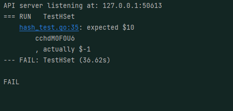

发现actual实际为Nullreply
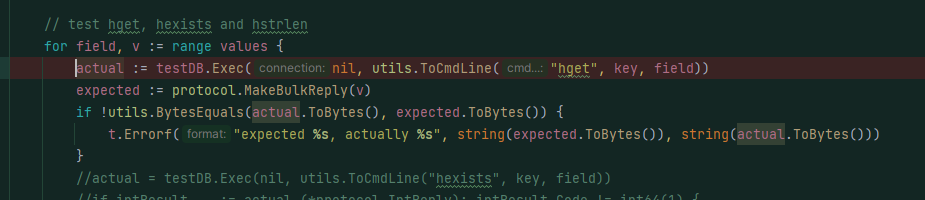
初始化的时候没有在db中写入数据！！！
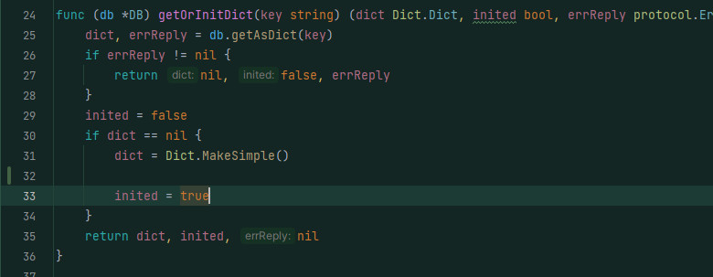
其他测试代码均通过
## 7/24
解决sorted和hash的报错信息
错误1：
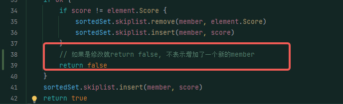
报错2
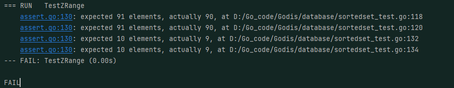
是计算stop和start的时候有一点问题
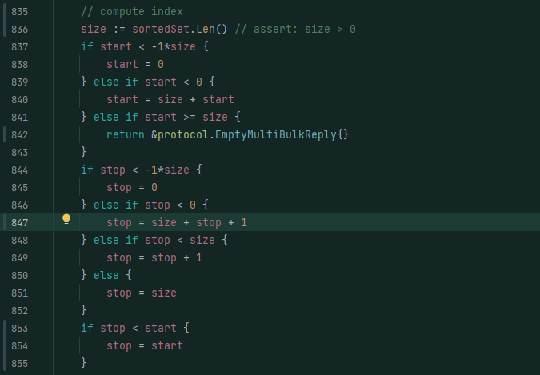
报错3:
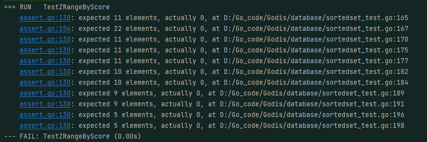
原因是inf有问题：Inf的初始化应该是0，否则会
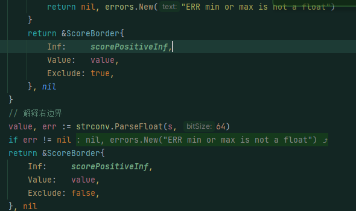
在这里报错
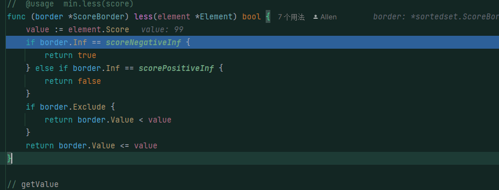
这里如果需要遍历成功需要保证gtMin和ItMax都是true，但是有false所以出现了遍历错误
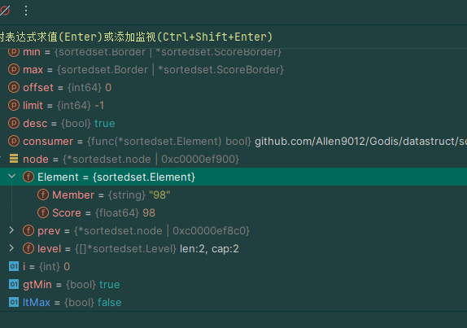
仔细查找后发现这里有问题
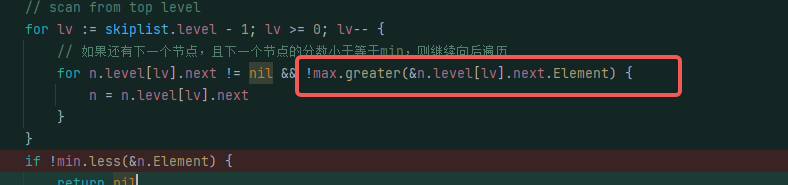
至此zset测试已经通过了
## 7/19 
实现了hash和sortedSet
但是测试still没有通过，还存在一些bug
## 7/16
实现HashMap的时候尝试重新改造和
实现k-v型存储的方式，来提升性能
使用FNW算法和使用稍微简单一点的分段锁的策略来实现

fnv32(key string) uint32函数是一个基于FNV-1a哈希算法的32位哈希函数。它接受一个字符串key作为输入，并将其转换为一个32位无符号整数（uint32）的哈希值。该函数通过不断迭代和混合素数与字符的ASCII码来计算哈希值。在哈希计算开始时，使用常量2166136261（16进制为0x811C9DC5）作为初始值。在每次迭代中，哈希值与素数（prime32）相乘，然后与当前字符的ASCII码异或。最终得到的哈希值就是所求的结果。

spread(hashCode uint32) uint32函数是一个散列函数，用于将哈希值散列到哈希表的索引范围内。该函数接受一个32位的哈希值hashCode作为输入，并返回一个在哈希表大小范围内的索引值。它通过将hashCode与哈希表大小减1（tableSize - 1）进行按位与操作来实现。这样可以确保计算出的索引值在合法的范围内，即在0到(tableSize - 1)之间。

getShard(index uint32) *shard函数是用于获取并发哈希表中特定索引位置的分片（shard）。哈希表被分成多个分片，每个分片是一个独立的哈希表，用于处理并发访问。在这个函数中，通过传入的索引值index获取相应的分片。若哈希表为空（dict为nil），则会触发panic。
## 7/13 
实现部分接口
对于zset的range 和border理解和实现

## 7/10
实现了所有的zset，增加测试代码，找到了一个插入的bug
1. BUG1:

2. BUG2: 没有连接

## 7/9 
实现了大部分的Sortedset
## 7/8
skipList的实现
## 7/7
优化增加SortedSet结构
首先写skiplist，过程中
## 7/4 优化
优化了随机数种子的失效问题,
> 由于使用了`var r = rand.New(rand.NewSource(time.Now().UnixNano()))` 所以说如果rand.NewSource 函数用于创建一个新的伪随机数生成器种子。而 rand.Seed 函数用于初始化默认的伪随机数生成器种子。在每次调用 rand.Intn 之前，如果没有调用 rand.Seed 函数设置种子，将会使用默认的种子，导致生成的随机数序列相同，导致seed一样，导致字符串是一样的，解决方法是吧局部变量编程全局变量，避免在函数调用的时候生成相同的种子，提高随机性
rand.NewSource(time.Now().UnixNano()) 移到函数外部作为全局变量，并在程序启动时使用 rand.Seed 函数设置种子。这样可以避免在每次函数调用时生成相同的种子。
优化增加了set的测试代码
## 7/2 优化
+ 优化standalone_server 执行方法 
+ 客户端conn， 优化使用sync.Pool缓冲池 
+ 增加封装aofHandler进入persistance 持久化机制 
+ 重命名和修改一些细节
+ 修改之后集群模式可能有一点问题
+ StandaloneServer实现了DBEngine不只是DB
+ 需要优化很多地方：prepare和undo模式， slave很久之后优化，conn的优化 ，database.db的优化
